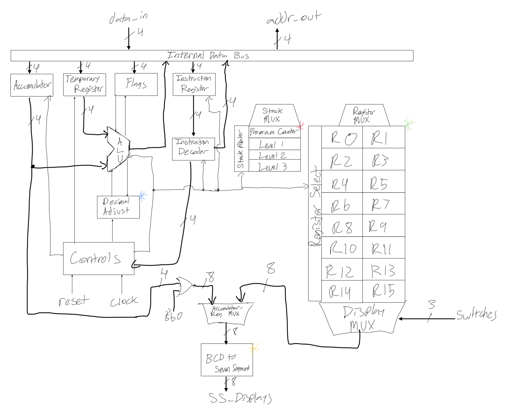
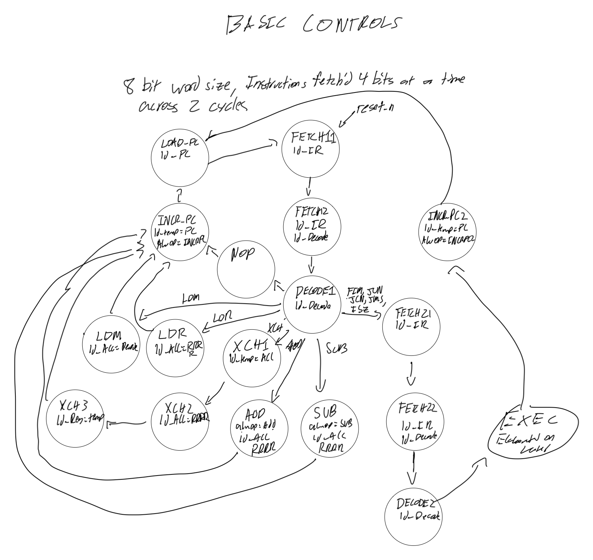

# 0xFA4_CPU
Julian Rodriguez
18-224/624 Spring 2023 Final Tapeout Project
## Overview
The 0xFA4_CPU is a 4 bit microprocessor inspired by the Intel 4004 CPU.
## How it Works
Architecture Overview

Controlpath

## Inputs/Outputs
INPUTS
4 Lines for instruction/data entry
3 Switches to select register pair for Seven Segment Display
1 Button which when held displays the value in the Accumulator
OUTPUTS
4 Lines for address out to ROM
8 Lines feeding 2 Seven Segment Displays
## Design Testing / Bringup

## Media

